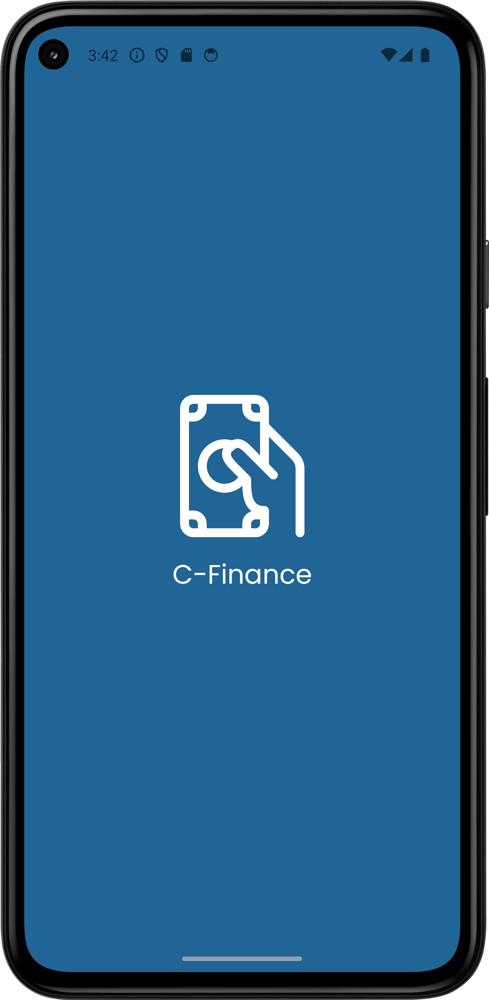
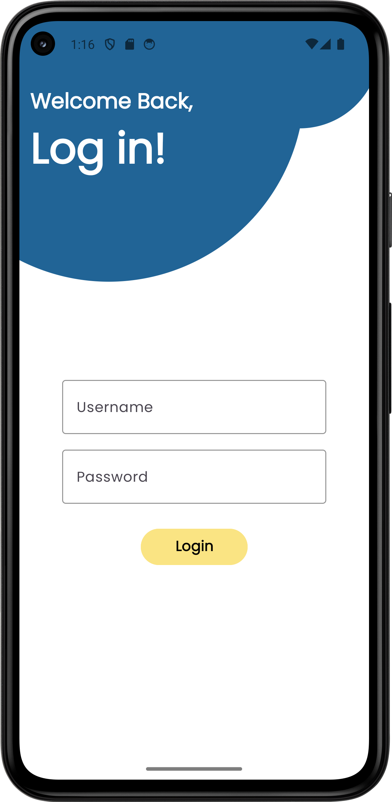
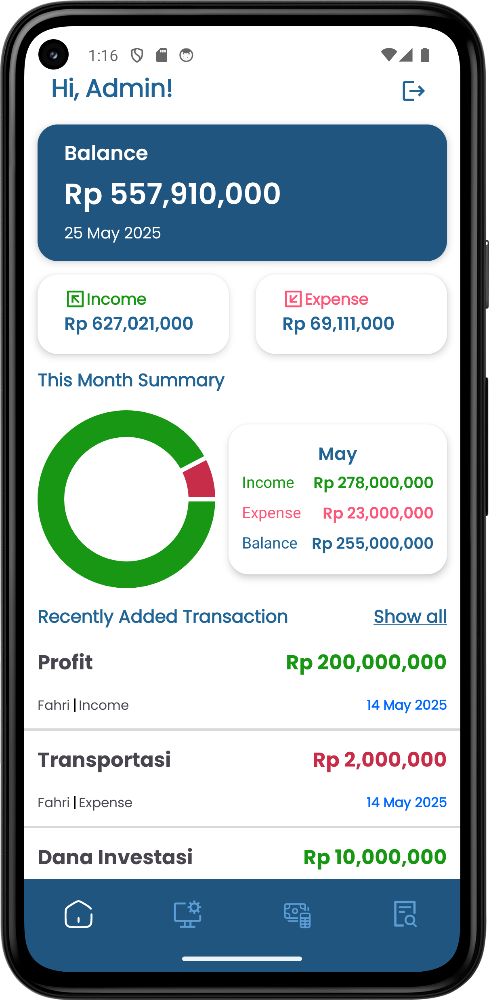

> **Final Internship Project at Creative Gama Studio**

[](https://android.com)
[](https://kotlinlang.org)
[](LICENSE)
[](releases)

---
## 🚀 Overview

**C-Finance** is a comprehensive Android admin panel for financial management developed as the capstone project for my internship at **Creative Gama Studio**. This application provides administrators with powerful tools to oversee and manage user financial data across the platform.

### ✨ Admin Features

🔐 **Secure Admin Login** - JWT-based authentication with token management  
📊 **Comprehensive Dashboard** - Real-time financial data overview in HomeFragment  
📅 **Advanced Data Filtering** - Filter cashflow by date ranges and transaction types  
💰 **Financial Analytics** - Automatic calculation of income, expenses, and balance  
📄 **Export Functionality** - Generate PDF and Excel reports via ExportDialogFragment  
🏷️ **Category Management** - Full CRUD operations for income/expense categories  
👥 **User Management** - Complete user account administration with add/update features  
📋 **Activity Logging** - Comprehensive user activity tracking with pagination  
🗑️ **Recycle Bin** - View and restore deleted financial data for audit purposes  

---

## 📱 Screenshots

| Splash Screen | Login | Dashboard |
|-------|-----------|-------------------|
|  |  |  | 

---

## 🛠️ Technology Stack

### 📱 **Frontend (Android)**
- **Platform**: Android (SDK 21+)
- **Language**: Kotlin
- **Architecture**: MVVM (Model-View-ViewModel)
- **UI Framework**: Material Design Components
- **HTTP Client**: Retrofit2 + OkHttp3
- **JSON Parsing**: Gson
- **Export Libraries**: iText (PDF), Apache POI (Excel)
- **Authentication**: JWT Token-based authentication
- **Local Storage**: SharedPreferences for session management
- **Date Picker**: Material Date Picker
- **Loading States**: Progress bars and skeleton loading
- **Error Handling**: Custom exception handling with user-friendly messages
- **Testing**: JUnit, Espresso, MockK

### 🌐 **Backend**
- **Environment**: cPanel Hosting with PHP Native APIs
- **Database**: MySQL
- **Authentication**: JWT tokens

---

## 🎯 Project Scope

This application was developed during my internship program at **Creative Gama Studio** as a demonstration of:

✅ **Full-Stack Android Development** (Kotlin + PHP)  
✅ **MVVM Architecture with Repository Pattern**  
✅ **Fragment-based Navigation & Bottom Navigation**  
✅ **Pagination with Paging 3 Library**  
✅ **RESTful API Integration with Retrofit**  
✅ **Role-Based Admin Panel Development**  
✅ **Data Export & Reporting Systems**  

---

Based on supervisor requirements, the application includes:

### 🔐 **1. Admin Authentication**
- Secure login system for administrative access
- Role-based authentication and authorization

### 🏠 **2. Dashboard (Home Page)**
- **Comprehensive Data View**: Display all user financial data (income/expenses)
- **Date Range Filtering**: Filter transactions from date to date
- **Transaction Type Filter**: Separate views for income or expense data
- **Financial Summary**: Real-time calculation and display of:
  - Total Income
  - Total Expenses  
  - Current Balance
- **Data Export**: Generate reports in PDF and Excel formats

### 🏷️ **3. Category Management**
- **Add Categories**: Create new categories for user transactions
- **Category Types**: Support for both income and expense categories
- **Edit Categories**: Modify existing category details
- **Delete Categories**: Remove unused categories from the system

### 👥 **4. User Account Management**
- View and manage user account information
- User profile oversight and administration

### 🗑️ **5. Deleted Data Recovery**
- **Audit Trail**: View income/expense data deleted by users
- **Data Recovery**: Restore accidentally deleted transactions
- **Administrative Oversight**: Monitor user deletion activities# 💰 C-Finance
### *Smart Financial Management for Android*

> **Backend**: The application connects to PHP APIs hosted on cPanel. Backend setup details are managed separately.

---

## 🏗️ Android Architecture & Implementation

### 📱 **Project Structure**
```
app/
├── src/main/java/com/dicoding/c_finance/
│   ├── ViewModelFactory.kt           # ViewModel factory for dependency injection
│   │
│   ├── model/
│   │   ├── api/
│   │   │   ├── ApiConfig.kt          # Retrofit configuration
│   │   │   └── ApiService.kt         # API endpoints interface
│   │   ├── pref/
│   │   │   ├── UserPreference.kt     # SharedPreferences manager
│   │   │   └── UserToken.kt          # Token data class
│   │   ├── repo/
│   │   │   └── FinanceRepository.kt  # Data repository layer
│   │   └── response/                 # API response models
│   │       ├── GlobalResponse.kt
│   │       ├── cashflow/GetCashflowResponse.kt
│   │       ├── category/GetCategoryResponse.kt
│   │       ├── log/GetLogResponse.kt
│   │       ├── login/LoginResponse.kt
│   │       ├── recyclebin/GetRecyclebinResponse.kt
│   │       └── user/GetUserResponse.kt
│   │
│   ├── utils/
│   │   ├── CashflowAdapter.kt        # Cashflow RecyclerView adapter
│   │   ├── CategoryAdapter.kt        # Category RecyclerView adapter
│   │   ├── UserAdapter.kt           # User management adapter
│   │   ├── RecyclebinAdapter.kt     # Deleted data adapter
│   │   ├── PagingLogAdapter.kt      # Pagination for logs
│   │   ├── LogPagingSource.kt       # Paging source for logs
│   │   ├── LoadingStateAdapter.kt   # Loading state handling
│   │   ├── LogViewPager.kt         # ViewPager for log tabs
│   │   ├── ManageViewPager.kt      # ViewPager for management
│   │   ├── Helper.kt               # Utility functions
│   │   └── Injection.kt            # Dependency injection
│   │
│   └── view/                        # UI Layer (Activities & Fragments)
│       ├── splash/
│       │   └── SplashActivity.kt
│       ├── login/
│       │   ├── LoginActivity.kt
│       │   └── LoginViewModel.kt
│       ├── main/
│       │   ├── MainActivity.kt      # Main container with bottom nav
│       │   └── viewmodel/MainViewModel.kt
│       ├── home/
│       │   ├── HomeFragment.kt      # Dashboard fragment
│       │   └── viewmodel/HomeViewModel.kt
│       ├── cashflow/
│       │   ├── CashflowFragment.kt  # Financial data display
│       │   ├── CashflowAddUpdateActivity.kt
│       │   ├── CashflowDetailDialogFragment.kt
│       │   ├── ExportDialogFragment.kt
│       │   └── viewmodel/
│       │       ├── CashflowViewModel.kt
│       │       └── CashflowAddUpdateViewModel.kt
│       ├── managehub/
│       │   ├── ManageFragment.kt    # Management hub container
│       │   ├── CategoryFragment.kt  # Category management
│       │   ├── UserFragment.kt      # User management
│       │   ├── ManageCategoryDialogFragment.kt
│       │   ├── ManageUserDialogFragment.kt
│       │   ├── ManageUsersAddUpdateActivity.kt
│       │   └── viewmodel/
│       │       ├── CategoryViewModel.kt
│       │       ├── UsersViewModel.kt
│       │       └── UsersAddUpdateViewModel.kt
│       └── log/
│           ├── LogFragment.kt       # Activity logs
│           ├── UserLogFragment.kt   # User-specific logs
│           ├── RecycleBinFragment.kt # Deleted data recovery
│           └── viewmodel/
│               ├── LogViewModel.kt
│               └── RecyclebinViewModel.kt
│
├── src/main/res/
│   ├── layout/                      # XML layouts for all screens
│   ├── drawable/                    # Icons and vector graphics
│   ├── values/                      # Colors, strings, styles
│   ├── font/                        # Poppins font family
│   └── menu/                        # Bottom navigation menu
│
└── src/test/java/                   # Unit tests
```

#### **3. Advanced Features Implementation**
- **Bottom Navigation**: 5 main sections (Home, Cashflow, ManageHub, Log, Profile)
- **Fragment-based Navigation**: Smooth transitions between screens
- **Dialog Fragments**: For add/edit operations and exports
- **ViewPager Integration**: Tabbed interfaces for logs and management
- **Pagination**: Efficient loading of large datasets with Paging 3
- **Export Functionality**: PDF/Excel generation through dialog interface
- **Real-time Updates**: LiveData observers for reactive UI

#### **4. Data Management**
- **Token Management**: Secure JWT storage with UserPreference
- **Response Handling**: Standardized GlobalResponse wrapper
- **Error Handling**: Comprehensive error states across all ViewModels
- **Loading States**: Custom LoadingStateAdapter for better UX
- **Offline Support**: Repository pattern with local caching strategy

#### **5. UI/UX Features**
- **Material Design**: Custom themes and color schemes
- **Custom Fonts**: Poppins font family integration
- **Responsive Design**: Optimized layouts for different screen sizes
- **Night Mode**: Dark theme support in themes.xml
- **Custom Drawables**: Vector graphics for consistent iconography
- **Smooth Animations**: Fragment transitions and RecyclerView animations

---

## 🎨 Design Principles

- **Material Design 3.0** - Following Google's latest design guidelines
- **Accessibility First** - Ensuring the app is usable by everyone
- **Performance Optimized** - Smooth animations and responsive interactions
- **Data-Driven UI** - Real-time updates based on user financial data

---

## 🏢 About Creative Gama Studio

This project was completed as part of my internship program at **Creative Gama Studio**, a leading software development company specializing in mobile applications and digital solutions.

**Internship Period**: Nov 2024 - Jam 2025 
**Duration**: 2-3 Weeks

---

## 📞 Contact

**Developer**: Salman Luthfi Sugiarto  
**Email**: salmanluthfi456@gmail.com 
**LinkedIn**:   www.linkedin.com/in/salman-luthfi-sugiarto-17b742301

---

## 🙏 Acknowledgments

- **Creative Gama Studio** team for guidance and mentorship
- **Android Developer Community** for invaluable resources
- **Material Design Team** for excellent design guidelines

---

<div align="center">

**Made with ❤️ during my internship at Creative Gama Studio**


</div>
